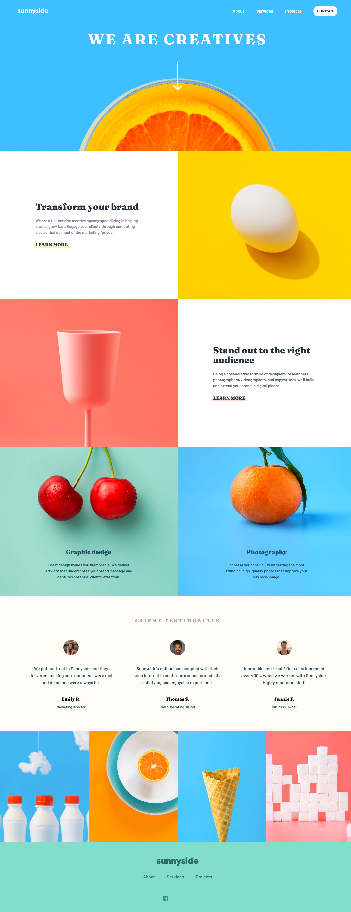

# Frontend Mentor - Sunnyside agency landing page solution

This is a solution to the [Sunnyside agency landing page challenge on Frontend Mentor](https://www.frontendmentor.io/challenges/sunnyside-agency-landing-page-7yVs3B6ef). Frontend Mentor challenges help you improve your coding skills by building realistic projects.

## Table of contents

- [Overview](#overview)
  - [The challenge](#the-challenge)
  - [Screenshot](#screenshot)
  - [Links](#links)
- [My process](#my-process)
  - [Built with](#built-with)
  - [What I learned](#what-i-learned)
  - [Continued development](#continued-development)
  - [Useful resources](#useful-resources)
- [Author](#author)
- [Acknowledgments](#acknowledgments)

## Overview

### The challenge

Users should be able to:

- View the optimal layout for the site depending on their device's screen size
- See hover states for all interactive elements on the page

### Screenshot

### Links

- Solution URL: [Solution](https://www.frontendmentor.io/solutions/sunnyside-agency-landing-page-using-tailwindcss-and-gsap-M-7dP2Z70N)
- Live Site URL: [Live site](https://mauriciompf.github.io/Sunnyside-agency-landing-page/src/)

## My process

### Built with

- Semantic HTML5 markup
- Flexbox
- Mobile-first workflow
- TailwindCSS: [TailwindCSS](https://tailwindcss.com/)
- GSAP: [GSAP](https://greensock.com/get-started-2/)